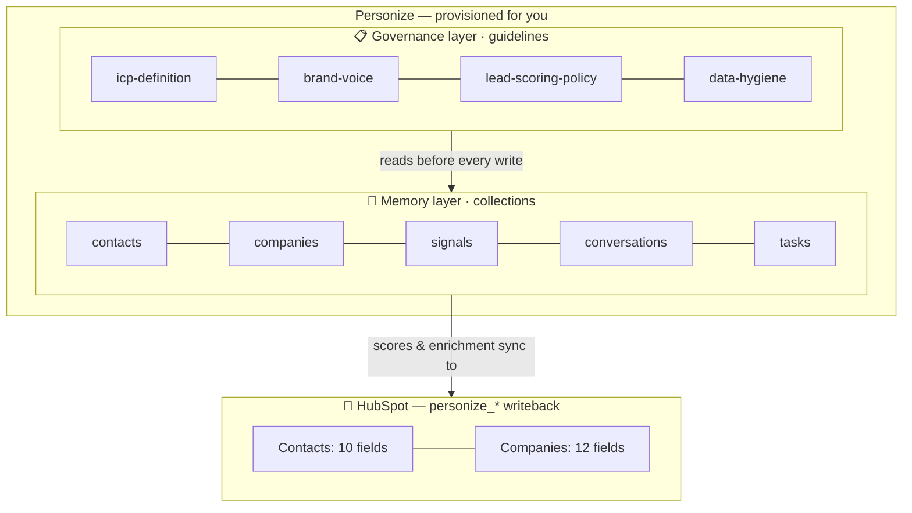

# AGENTS.md — Operating instructions for AI agents in this repo

> This file is the entry point for any AI agent (Claude Code, Codex, Cursor,
> custom MCP-connected agents) opening this repo. Read it once at session
> start; it tells you what this repo is, how it's organized, and how to act.

---

## What this repo is

The **CRM Agent Operating System** — an open pattern library that turns
HubSpot, Salesforce, and other CRMs into AI-operable systems through
Personize. The repo's primary reader is **you**, the AI agent. It exists to
teach you what's possible with Personize + a connected CRM, and to give you
working starting points (operations) you can extend.

Three layers of capability:

1. **Memory layer** — every contact, company, deal, signal, conversation lives
   in Personize as a schema-enforced record. Define new properties via
   `manifests/core/collections/*.json`. Records can also be linked by **graph
   edges** — see "Declaring graph edges" below.
2. **Governance layer** — guidelines, ICP, brand voice, compliance live as
   plain-English markdown in `manifests/core/guidelines/*.md`. Every operation
   reads these before acting.
3. **Operations layer** — atomic units of work registered in
   `src/core/operations/registry.ts`. Each operation declares what it reads,
   what it writes, what governance it requires, and what its cost class is.
   You discover them via `operation_list`, run them via `operation_run`.

---

## Session startup — required reads

Run these on your first turn before responding:

1. **Load the agent operating playbook**:
   `context_retrieve(message='agent operating playbook', contextNames=['agent-playbook'])`
   This is the canonical RECALL → GOVERN → ACT → STORE loop. Every substantive
   turn follows it.

2. **Discover available operations**:
   - Via MCP: call the `operation_list` tool
   - Via CLI: read `src/core/operations/registry.ts`
   The returned metadata (`category`, `status`, `cost`, `idempotent`,
   `run_mode`, `guidelines_required`) tells you what each operation does and
   whether to run it.

3. **Load any guidelines relevant to the user's intent**:
   `context_retrieve(message=<user's first message>, types=['guideline'])`

4. **Surface state to the user** — what's set up, what operations are
   available, what you'll do this session.

---

## Before `setup.apply` — interview the business (MANDATORY)

The governance templates under `manifests/core/guidelines/` (`icp-definition.md`,
`brand-voice.md`, `competitor-policy.md`) ship with **bracketed placeholders**
(`[your target verticals]`, `[list of target titles]`, …). `setup.apply` upserts
whatever is on disk **verbatim** — it does NOT ask about the user's business. So
if you run setup without acting first, the org gets governance full of unfilled
brackets and every downstream `score.*` / `generate.*` operation reasons against
placeholder text. That is a broken setup.

Therefore, on any `setup.apply` (or `setup diff`) request, you MUST run a short
**business interview first** and capture the answers as an org overlay. Do not
skip this even if the user just says "set it up."

1. **Interview.** Ask the user (batch the questions; don't interrogate one at a
   time) for at least:
   - **ICP** — target industries, employee/revenue range, growth stage, required
     tech stack, and disqualifiers. (→ `icp-definition.md`)
   - **Brand voice** — tone, words/claims to avoid, sender persona. (→ `brand-voice.md`)
   - **Competitors** — who they compete with and how to handle competitor
     mentions. (→ `competitor-policy.md`)
   - **Scoring weights** if they have a strong opinion; otherwise keep template
     defaults.
2. **Write the overlay, never edit core.** For each answered template, write a
   filled copy to `manifests/local/guidelines/<name>.md` (same `name:` in
   frontmatter). `manifests/local/` is git-ignored and **wins over
   `manifests/core/`** per-file at apply time, so a later `setup` never resets the
   user's answers. Editing the shared `manifests/core/` templates directly is an
   anti-pattern.
3. **Confirm, then apply.** Show the filled overlay back to the user, then run
   `setup diff` and only then `setup.apply`.
4. **No brackets ship.** Before applying, grep the effective guideline set for
   `[` placeholder text. If any remain in a guideline that governs scoring or
   generation, stop and finish the interview — don't apply half-filled governance.

If the user genuinely wants the generic starter templates (e.g. a quick kick-the-
tires run), that's allowed — but say so explicitly and note that scoring/outreach
quality will be generic until the overlay is filled.

## Syncing a custom entity (deal / ticket / custom object) — ask for its identifier

Standard entities (contact, company) need nothing from you: Personize auto-maps
their fields and keys them on email / website. **Custom entities have no such
default key** — before syncing one you MUST ask the user which field uniquely
identifies each record, because Personize keys the imported records by it and all
downstream retrieve/writeback address them by the same key.

Custom entities are manifest-driven (`crm-custom-entities.ts` discovers any
collection manifest with a `crmSync` block where `standard !== true`).
[`manifests/core/collections/deals.json`](manifests/core/collections/deals.json)
is the reference: it declares `crmSync.identity = { keyName, crmFields }`. Adding a
new custom entity is a manifest drop — no code.

On a request to sync a non-standard entity:

1. **Ask for the identifier.** "What uniquely identifies a `<entity>` in your CRM?"
   (e.g. a deal's name → HubSpot `dealname`, a ticket's subject → `subject`). If a
   shipped manifest already declares a sensible default, confirm it rather than
   re-ask.
2. **Record it as an overlay, never edit core.** Write
   `manifests/local/collections/<entity>.json` with the `crmSync.identity` set to
   the user's answer (`keyName` = a mapped property systemName; `crmFields.<crm>` =
   the native field) plus the property `crmFields` you want imported.
   `manifests/local/` wins per-file, so a later `setup` never resets it.
3. **Dry-run to validate, then sync.** `crm.sync-core` dry-run validates the
   custom entity's manifest locally (mapping count, identity key mapped, source
   field present) — a misconfig surfaces here, not mid-run. Then sync live with
   `objects: ["<entityType>"]`; custom entities are opt-in and never sync by
   default.

## After the first `setup.apply` — show the setup as a diagram

The first time setup provisions an org (collections created, guidelines applied,
CRM `personize_*` properties added), the user has no visual of what now exists in
Personize on their behalf. Give them one: **render a Mermaid diagram of the three
layers and what landed in each**, so they can see their memory + governance + CRM
surface at a glance instead of reading a JSON result.

Do this **only if your assistant surface renders Mermaid** (e.g. a chat/canvas UI
that draws ```mermaid fenced blocks). If you're a plain-text CLI that can't render
it, **skip the diagram** — don't dump raw Mermaid source at the user; a short
bulleted summary of counts is the fallback. This is a nicety, never a blocker.

When you do render it:

- Trigger it once, right after the **first** successful `setup.apply` for an org
  (not `setup diff`, and not on later idempotent re-runs where nothing changed).
- Drive it from the actual `setup.apply` result — the `collections`,
  `guidelines`, and `crmProperties` it reports — plus the connected CRM. Show real
  names/counts, never a hard-coded example.
- Keep it to the three capability layers so it mirrors how this repo is organized:
  **Memory** (collections), **Governance** (guidelines), **CRM writeback**
  (`personize_*` fields on the connected objects).

Shape to follow (fill in with the real result — this is illustrative):



Follow the diagram with one line of plain text stating the totals (e.g. "13
collections, 18 guidelines, 22 CRM fields on HubSpot") so the summary survives
even where Mermaid doesn't render.

## How to use the operations registry

Every operation has a `status`:

| Status | What `run()` does | What you do as the agent |
|--------|------------------|--------------------------|
| `live` | Executes the real algorithm, makes real Personize/CRM changes (gated by `DRY_RUN`). | Run it when its filter/inputs match the task. |
| `scaffold` | Returns a **rehearsal envelope** — `intent`, `inputs_received`, `would_read_from`, `would_write_to`, `governance_required`, `next_steps_to_make_live`. No real changes. | Read the rehearsal. If the user wants this done, follow `next_steps_to_make_live` to upgrade it to `live`. |
| `idea` | Returns a description-only response. No execution logic. | Treat as a spec. Implement only when the user asks for it. |

**Filter shape** (declarative JSON, not arbitrary code):

```json
{
  "collection": "contacts",
  "where": { "lifecycle_stage": "MQL", "ai_score": { "gte": 70 } },
  "limit": 100
}
```

Use this shape when calling operations. Operations declare what filter shape
they accept in their schema. Don't invent filter formats per operation.

**Run mode tells you when to run an operation:**

- `always` — schedule or trigger this on its natural cadence (e.g. nightly
  sync). Don't ask the user every time.
- `on-trigger` — run when an event fires (a webhook, a CRM change, a new
  signal). The trigger comes from outside.
- `on-decision` — run only when reasoning concludes it's needed. Don't run
  speculatively.
- `manual` — only when the user explicitly asks.

---

## How to add a new operation

When the user asks for new behavior that doesn't fit an existing operation:

1. **Pick a category**: `setup`, `sync`, `research`, `score`, `generate`,
   `analyze`, `act`, `optimize`. Each operation does one thing in one
   category.
2. **Declare the contract**: what records it reads, what governance it needs,
   what properties it writes, what its cost class is.
3. **Start as `scaffold`**: return the rehearsal envelope first. Confirm with
   the user that the intent and contract are right.
4. **Promote to `live`**: implement the algorithm, write tests, update the
   `status` field.
5. **Always write to workspace**: append to `workspace.updates` on every
   record you touch. This is how teammate agents see what you did.

---

## Hard rules

These rules apply to every operation in this repo, every agent that runs them.

1. **CRM access goes through Personize, never raw fetch.** Two surfaces, by job:
   - **Bulk record import / write-back** (contacts, companies, deals) →
     Personize-managed sync via `src/adapters/personize-sync.ts`
     (`crm.sync-core` for sync-in, `crm.sync-out` for write-back). Personize
     owns the connection, pagination, field mapping, dedupe, and association
     linking — our code only picks a provider + objects and triggers/polls.
   - **Engagement side-channel** (emails, tasks, notes, lifecycle reads) →
     `src/adapters/{hubspot,salesforce}/adapter.ts`, which wraps the Personize
     CRM Passthrough (OAuth, rate limiting, audit handled for you).

   Never call HubSpot or Salesforce APIs directly, and never paginate/field-map
   bulk records by hand — that's the managed sync's job.

2. **Default to `DRY_RUN=true`.** Live writes (Personize or CRM) require
   `DRY_RUN=false` in the environment. Show what you would do before doing it.

3. **Read governance before writing.** Before any `act.*` or `generate.*`
   operation runs, load the relevant guideline via `context_retrieve`. Apply
   the rules. Do not improvise.

4. **Workspace writes are mandatory.** Every operation that touches a record
   appends to that record's `workspace.updates` array. Cross-agent visibility
   is a feature, not a side effect.

5. **Never overwrite human-entered CRM values** unless the operation's mapping
   explicitly allows it. Low-confidence AI values write to dedicated AI custom
   properties on the CRM, not to native fields.

5b. **Never `setup.apply` with unfilled governance.** The guideline templates are
   placeholders. Interview the business and write a `manifests/local/` overlay
   before applying — see "Before `setup.apply` — interview the business". Applying
   bracketed templates verbatim is a broken setup, not a valid default.

6. **Idempotence first.** An operation should be safe to re-run on the same
   record. Use `skip_if` to avoid re-doing work that's already fresh.

---

## Where things live

```
crm-ai-operators/
├── README.md                      ← marketing pitch
├── AGENTS.md                      ← this file
├── docs/
│   └── RUNTIME.md                 ← Setup / Operation / Optimization modes
├── manifests/
│   ├── core/                      ← CRM-independent (always applied)
│   │   ├── collections/*.json     ← Personize schema definitions
│   │   └── guidelines/*.md        ← governance, applied via setup.apply
│   ├── hubspot/                   ← HubSpot-specific manifests
│   └── salesforce/                ← Salesforce-specific manifests
├── src/
│   ├── core/
│   │   ├── config.ts              ← Personize SDK client (lazy)
│   │   ├── operations/
│   │   │   ├── registry.ts        ← all operations registered here
│   │   │   └── types.ts           ← OperationEntry, ScaffoldResult, etc.
│   │   ├── engine/
│   │   │   ├── dispatcher.ts      ← data-driven route dispatch (5 patterns)
│   │   │   ├── orchestrator.ts    ← runs routes, circuit breaker
│   │   │   └── webhook-server.ts  ← HMAC-signed webhook trigger server
│   │   ├── runtime/
│   │   │   ├── operation-runner.ts  ← runs operations + audit + run-store
│   │   │   ├── audit-log.ts       ← JSONL append per day
│   │   │   └── run-store.ts       ← persists to Personize operation-runs
│   │   ├── setup/
│   │   │   └── apply-manifests.ts ← idempotent collection + guideline upsert
│   │   └── lib/                   ← logger, dry-run, helpers
│   ├── adapters/
│   │   ├── passthrough.ts         ← Personize CRM Passthrough wrapper
│   │   ├── hubspot/adapter.ts     ← HubSpot typed surface
│   │   └── salesforce/adapter.ts  ← Salesforce typed surface
│   ├── mcp/server.ts              ← MCP server (operation_list, operation_run)
│   └── scripts/crm-agent.ts       ← CLI
└── data/
    └── audit/*.jsonl              ← per-day audit log
```

---

## Common patterns to follow

**When the user mentions a contact or company by email/domain:**
Recall first via `memory_retrieve(email=...)`. Don't act on conversational
context alone.

**When the user asks "how do we handle X":**
Search guidelines via `context_retrieve(message=...)`. Don't make up a policy.

**When the user wants something done at scale (5+ records):**
Use `operation_run` with a filter, not a loop of individual API calls.
Operations are designed to batch.

**When you complete an action:**
Append to the entity's `workspace.updates` array AND store an atomic fact
via `memory_save(email=..., content=...)`. The audit trail is not optional.
Before that save, run the edge protocol (see "Building graph edges on every
save") — fetch `relation_types`, validate, and attach the valid `relations` so
the graph grows with the memory, not after it.

**When to use the `tasks` collection vs acting directly:**
Create a task when the work is queued, deferred, requires approval, or needs
cross-agent visibility before execution. Just act when the work is the
immediate execution of the current operation. See `tasks-and-projects` guideline.

---

## Building graph edges on every save (MANDATORY)

Records are not enough — the memory is a **graph**, and edges only exist if
**you declare them**. Nothing infers relationships from content for you. So on
**every memory save where you know how the record relates to another entity**,
you MUST build the edges. Follow this protocol — it is not optional:

1. **FIND** the relationships. Look at the entities in scope (the record you're
   saving plus every other entity named in its data/content) and list the
   `from → relation → to` links that genuinely exist. A contact and their
   company → `works_at`. A meeting and its attendees → `participated_in`. A
   contact and their manager → `reports_to`.
2. **FETCH** the allowed relation types. Call the `relation_types` tool (MCP) or
   `crm-agent relations list` (CLI). This is the org's registry — the ONLY
   relation types and from/to entity pairs that are legal. Do not invent names.
3. **FILTER** your candidate edges down to legal ones. Call `relations_validate`
   (MCP) or `crm-agent relations validate` with your proposed edges; keep the
   `valid` set, discard `dropped`. Match each edge's `relationType` and its
   from/to entity types to a registry entry (`[]` in from/to means "any type").
4. **SAVE** with the polished edges attached — pass the validated `relations` in
   the save payload (`memory_save` / `memory.upsert`), or in code via the
   `relations` field on the `WriteTarget` / `SaveRecordInput` you hand `persist.*`.

In code, that fourth step looks like:

```ts
await setProperties(
  {
    type: "contact",
    email: contact.email,
    relations: [
      { relationType: REL.WORKS_AT, toIdentity: { kind: "domain", value: company.domain }, toEntityType: "company" },
    ],
  },
  { account_score_lift: company.icp_fit_score },
);
```

Guarantees and gotchas (`src/core/lib/graph.ts` + `persist.ts`):

- **The registry is the gate — twice.** You filter against it in step 3, and the
  save path re-validates every edge before sending (drops unknown/inactive types
  and disallowed from/to pairs, logged). So a bad edge can never corrupt a write —
  but if you skip steps 1–3 you simply get no graph.
- **Routing is automatic.** A save carrying ≥1 valid edge routes through the v1.1
  pipeline (the only backend that persists edges); a save with none stays on the
  plain path unchanged. Targets that don't exist yet become stubs, promoted when
  that entity is later upserted.
- **`REL` constants** in `graph.ts` hold the type names this repo uses; they're
  validated live, so adjust them if your org renames a type.
- **Async landing.** Edges arrive shortly after the save returns — don't
  read-after-write. An empty Relationships tab is usually the `includeStubs`
  display filter, not a missing edge.

## Anti-patterns

- **Reading raw CRM data inside a script.** Scripts read from Personize.
  CRM is a side-channel for engagement context (emails, tasks, notes), not a
  primary source. The exception is `sync.*` operations whose entire job is
  CRM ↔ Personize movement.

- **Inventing a filter shape per operation.** All filters are declarative
  JSON in the standard shape. Don't write per-operation filter parsers.

- **Skipping the rehearsal envelope.** When you write a new scaffold, return
  the full envelope (`intent`, `would_read_from`, `would_write_to`,
  `next_steps_to_make_live`). One-line summaries are not useful.

- **Overwriting a human-entered CRM value.** Always check whether the field
  was set by a human before writing. Use the CRM-side AI custom properties
  for AI-generated values.

- **Writing direct CRM API calls.** Always go through the adapter so the
  passthrough handles OAuth, rate limits, and audit.
