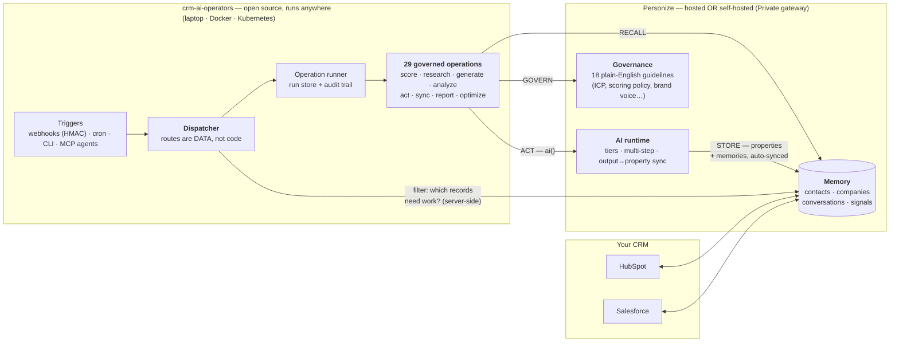
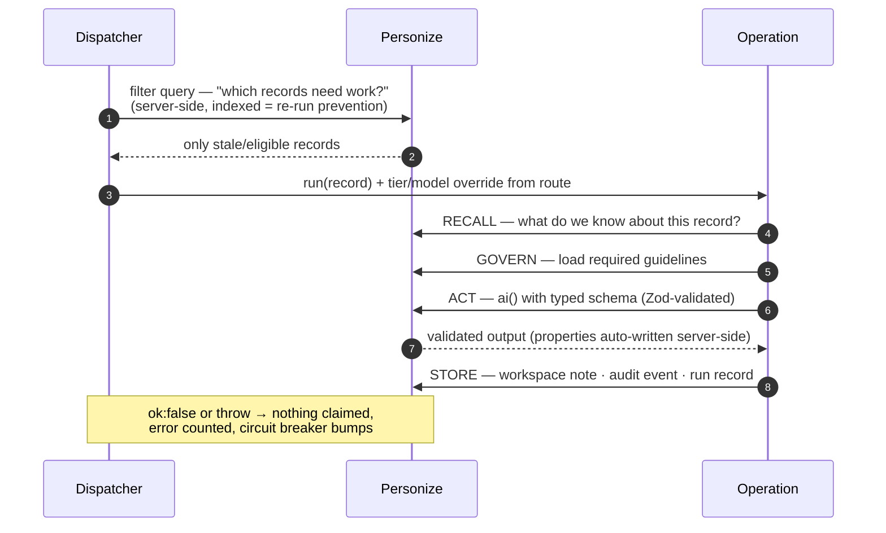
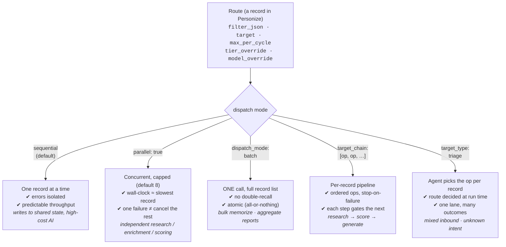
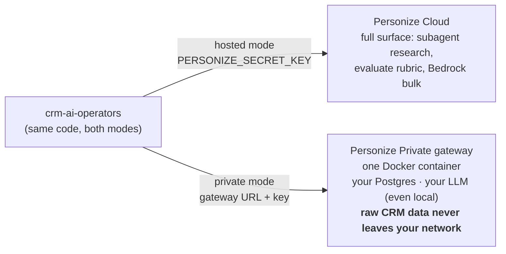

# Architecture — How CRM AI Operators Works

> One-page visual tour. All diagrams render natively on GitHub.

## 1. The big picture

Your CRM data lives in **Personize** (governed memory). The **engine** (this repo) decides *what work needs doing* and dispatches it. Every AI action is gated by plain-English **guidelines** your team owns.

**Key idea:** the engine is stateless and cheap — all heavy AI work is offloaded to Personize. Even sequential dispatch handles thousands of records/day on a small VM.

## 2. Every operation runs the same loop

## 3. Five dispatch patterns — chosen per route, in data

Routes also carry **cost control**: `tier_override` (basic / pro / ultra) and `model_override` (BYOK) — route the quick-scan lane to a cheap tier and the executive-facing lane to ultra, without touching operation code.

## 4. Safety model — why it's trustable in production

| Layer | Mechanism |
|---|---|
| Default posture | `DRY_RUN=true` until you explicitly authorize live writes |
| Governance | Operations refuse to run without their required guidelines installed |
| Re-run prevention | Staleness lives in the route *filter* (server-side) + `skip_if` in the op — idempotence means a crash-and-rerun is free |
| Failure handling | `ok:false` or throw → record not claimed, error counted; error threshold pauses the whole orchestrator (circuit breaker) |
| Audit | Every run: audit events + run record (scanned/updated/summary) persisted to Personize |
| Security | HMAC-signed webhooks (fail-closed), SSRF-guarded outbound, body-size limits |

## 5. Deployment: hosted or fully private

**The pitch in one sentence:** an open-source library of 29 governed, audited, idempotent AI operations over your CRM — orchestrated by data-driven routes, gated by guidelines your team writes in English, at ~$0.003/memorize and ~$0.001/recall, deployable down to fully air-gapped.
